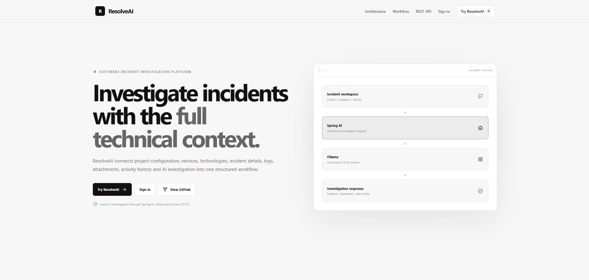
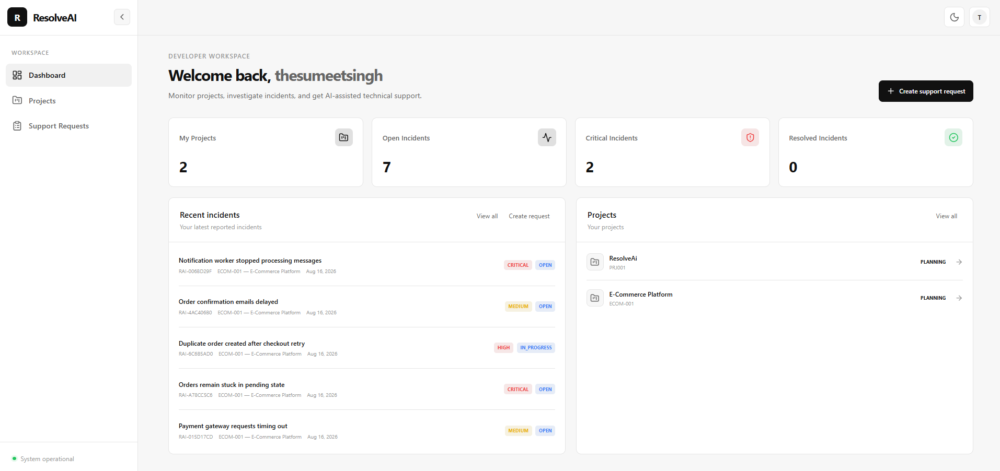
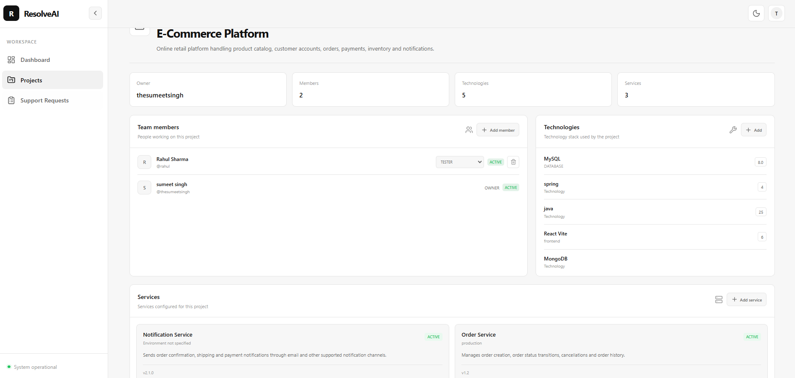
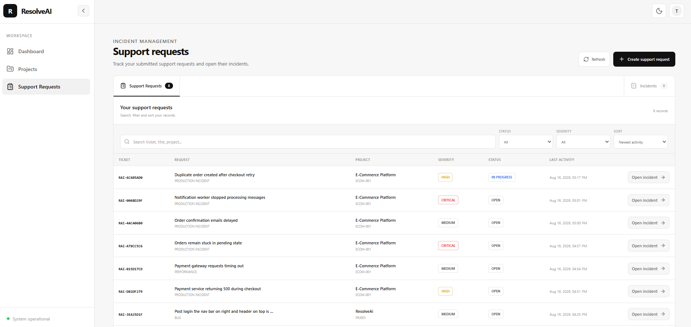
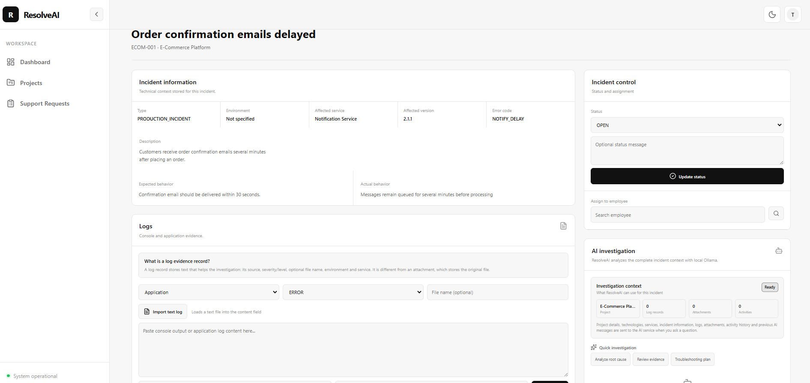
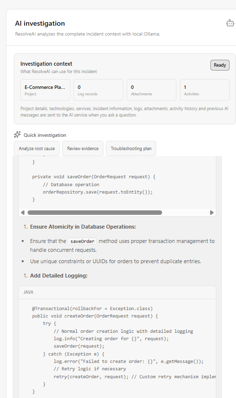
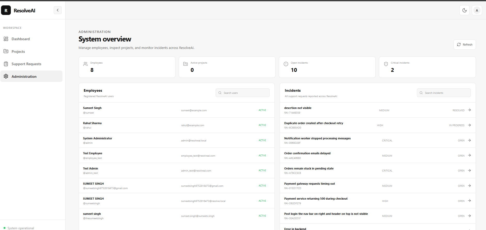

# ResolveAI

ResolveAI is a full-stack software incident investigation platform built to connect structured project information, support requests, incident evidence, operational history, and local AI-assisted investigation in one workflow.

The project is intentionally backend-focused. The frontend provides the workspace and evidence-collection interface, while the core engineering value is in the Spring Boot REST API, authentication and authorization, relational and document persistence, incident-context assembly, file-content extraction, and Spring AI integration with a local Ollama model.

## Repository

GitHub: https://github.com/thesumeetsingh/resolveai

Clone:

```bash
git clone https://github.com/thesumeetsingh/resolveai.git
cd resolveai
```

## Author

**Sumeet Singh**

GitHub: https://github.com/thesumeetsingh

Email: sumeetsingh9752818473@gmail.com

---

## What ResolveAI Does

ResolveAI follows an incident from its initial project context through AI-assisted investigation:

```text
User registration / login
        |
        v
Create or access a project
        |
        +--> Technologies
        +--> Project services
        +--> Project members
        |
        v
Create a support request
        |
        v
Incident / support ticket
        |
        +--> Incident details
        +--> Console / application logs
        +--> File attachments
        +--> Comments and activity history
        +--> Assignment and status
        |
        v
Build complete incident context
        |
        +--> Project information
        +--> Technology stack
        +--> Services
        +--> Incident information
        +--> Logs
        +--> Attachments and extracted text
        +--> Activity history
        +--> Previous AI conversation
        |
        v
Spring AI ChatClient
        |
        v
Ollama
        |
        v
Qwen 2.5:7b
        |
        v
AI investigation response
```

The important design point is that ResolveAI does not send only a user's question to the model. The backend assembles the project and incident context first, then sends that context together with the current question and previous AI conversation history.

---

## Core Backend Capabilities

### Spring Boot

Spring Boot provides the application runtime, dependency management, configuration model, embedded web application setup, and integration between the backend modules.

### Spring MVC

Spring MVC is used to expose REST controllers. Controllers separate HTTP/API concerns from business logic and persistence.

The backend is organized into feature areas such as:

- authentication and users
- projects
- support requests
- incident evidence
- administration
- AI conversations and investigation
- employee dashboard
- security

### Spring Security and JWT

The API uses stateless JWT authentication.

The authentication flow is:

```text
Login credentials
      |
      v
POST /api/auth/login
      |
      v
JWT token
      |
      v
Frontend sends Authorization: Bearer <token>
      |
      v
Spring Security JWT resource server
      |
      v
Authenticated controller/service
```

Role-based access is applied to protected API areas. The current security configuration distinguishes administrator APIs from employee/user-accessible APIs.

This is preferable to storing server-side sessions for this architecture because the API remains stateless and the authentication token can be carried by clients such as the React application.

### Spring Data JPA and Hibernate ORM

JPA/Hibernate is used for the relational domain model.

The current relational entities include:

- User
- Role
- Project
- ProjectMember
- ProjectTechnology
- ProjectServiceEntity
- Technology
- SupportRequest
- AIConversation

JPA/Hibernate is useful here because these records have explicit relationships, identifiers, statuses, roles, and transactional business rules.

Instead of manually writing SQL for every persistence operation, repositories and entity mappings provide the persistence abstraction while Hibernate handles object-relational mapping.

### MySQL

MySQL stores the structured relational application data.

It is used for data such as:

- users
- roles
- projects
- project memberships
- project technologies
- project services
- support requests / incidents
- AI conversation metadata

Relational storage is appropriate for this part of the system because these records have strong relationships and consistent business structure.

### MongoDB

MongoDB is used for flexible operational documents:

- incident logs
- incident activities
- incident attachments metadata
- AI messages

This separation is deliberate. Incident evidence and AI messages are document-oriented and can contain variable content without requiring every evidence record to have the same rigid relational shape.

The project therefore uses a polyglot persistence approach rather than forcing every data type into one database.

### Spring AI

Spring AI provides the AI integration layer inside the Spring application.

ResolveAI uses Spring AI's `ChatClient` to construct the investigation request and communicate with the configured model provider.

The backend AI service is responsible for:

1. authenticating the current user
2. verifying ownership of the AI conversation
3. identifying the incident associated with that conversation
4. building the complete incident context
5. loading previous AI messages
6. constructing the AI prompt
7. calling the model
8. storing the user question
9. storing the AI response
10. returning the response to the frontend

### Ollama and Qwen 2.5:7b

The current backend configuration points Spring AI to a local Ollama instance:

```properties
spring.ai.ollama.base-url=http://localhost:11434
spring.ai.ollama.chat.options.model=qwen2.5:7b
```

This keeps the model execution local during development instead of requiring a hosted model API.

The model is used as the reasoning layer. The application itself remains responsible for gathering and structuring the incident context.

### Apache Tika

Apache Tika is used for attachment text extraction.

When supported files are uploaded, the backend can extract textual content and include that extracted content in the incident context sent to the AI service.

This is important because an attachment should not be treated only as a filename. Its contents can become evidence for the investigation.

---

## Why MySQL and MongoDB Together

Using both databases is a deliberate architectural choice.

| Requirement | Storage | Reason |
|---|---|---|
| Users and roles | MySQL | Structured relational data |
| Projects | MySQL | Relational ownership and project metadata |
| Project members | MySQL | Strong project-user relationships |
| Technologies and services | MySQL | Structured project configuration |
| Support requests | MySQL | Transactional incident records |
| AI conversation metadata | MySQL | Conversation ownership and incident relationship |
| Incident logs | MongoDB | Flexible evidence documents |
| Incident activities | MongoDB | Event-style operational records |
| Attachment metadata/content context | MongoDB | Document-oriented evidence |
| AI messages | MongoDB | Variable conversational documents |

The advantage in this project is not that one database is universally better than the other. The advantage is matching the persistence model to the data characteristics.

---

## AI Context Architecture

The AI context is assembled by the backend before the model is called.

The context includes:

```text
PROJECT INFORMATION
- project name
- project code
- description
- status

TECHNOLOGIES
- technology names

SERVICES
- project service names

INCIDENT
- ticket number
- title
- description
- type
- severity
- status
- environment
- affected service
- affected version
- error code

EXPECTED BEHAVIOR
- expected behavior

ACTUAL BEHAVIOR
- actual behavior

INCIDENT LOGS
- source
- type
- service
- environment
- filename
- content

INCIDENT ACTIVITY HISTORY
- time
- actor
- activity type
- message
- status changes

ATTACHED FILES
- filename
- content type
- size
- extracted text

PREVIOUS AI CONVERSATION
- previous user messages
- previous AI messages

CURRENT USER QUESTION
- current investigation question
```

This design allows the AI to reason over the incident as a whole instead of treating each request as an isolated chatbot question.

---

## REST API Overview

Base URL during local development:

```text
http://localhost:8080/api
```

### Authentication

| Method | Endpoint | Purpose |
|---|---|---|
| POST | `/auth/register` | Register a user |
| POST | `/auth/login` | Authenticate and obtain JWT |

### User APIs

| Method | Endpoint | Purpose |
|---|---|---|
| GET | `/users/me` | Get the authenticated user |
| GET | `/users/employees` | Search employee users for project assignment |

### Employee Dashboard

| Method | Endpoint | Purpose |
|---|---|---|
| GET | `/employee/dashboard` | Dashboard statistics and recent reported incidents |

### Project APIs

| Method | Endpoint | Purpose |
|---|---|---|
| GET | `/projects` | List projects available to the authenticated user |
| POST | `/projects` | Create a project |
| GET | `/projects/{projectId}` | Get project details |
| POST | `/projects/{projectId}/members` | Add a project member |
| PUT | `/projects/{projectId}/members/{userId}` | Change project member role |
| DELETE | `/projects/{projectId}/members/{userId}` | Remove project member |
| GET | `/projects/{projectId}/technologies` | List project technologies |
| POST | `/projects/{projectId}/technologies` | Add technology |
| GET | `/projects/{projectId}/services` | List project services |
| POST | `/projects/{projectId}/services` | Add project service |

### Support Request and Incident APIs

| Method | Endpoint | Purpose |
|---|---|---|
| POST | `/support` | Create a support request / incident |
| GET | `/support/my` | List the authenticated user's support requests |
| PUT | `/support/{supportRequestId}/status` | Update incident status |
| PUT | `/support/{supportRequestId}/assign` | Assign an incident |
| POST | `/support/{supportRequestId}/comments` | Add incident comment |
| GET | `/support/{supportRequestId}/activities` | Read incident activity |

### Incident Evidence APIs

| Method | Endpoint | Purpose |
|---|---|---|
| GET | `/incidents/support/{supportRequestId}` | Read logs for an incident |
| GET | `/incidents/project/{projectId}` | Read logs associated with a project |
| POST | `/incidents/logs` | Add console/application log evidence |
| POST | `/incidents/{supportRequestId}/attachments` | Upload incident attachment |
| GET | `/incidents/{supportRequestId}/attachments` | List incident attachments |

### AI APIs

| Method | Endpoint | Purpose |
|---|---|---|
| POST | `/ai/conversations` | Create an AI investigation conversation |
| GET | `/ai/conversations/{conversationId}/messages` | Load conversation history |
| POST | `/ai/conversations/{conversationId}/ask` | Ask ResolveAI to investigate the incident |

### Admin APIs

| Method | Endpoint | Purpose |
|---|---|---|
| GET | `/admin/dashboard` | Administration statistics |
| GET | `/admin/users` | List users |
| GET | `/admin/support-requests` | List support requests |
| GET | `/admin/incidents/{supportRequestId}/logs` | Inspect incident logs |
| GET | `/admin/incidents/{supportRequestId}/activities` | Inspect incident activity |
| GET | `/admin/incidents/{supportRequestId}/attachments` | Inspect incident attachments |
| PUT | `/admin/incidents/{supportRequestId}/assign` | Admin incident assignment |
| PUT | `/admin/incidents/{supportRequestId}/status` | Admin incident status update |

---

## Backend Project Structure

```text
resolveai-backend/
└── src/main/java/com/sumeetsingh/resolveai/
    ├── admin/
    │   ├── controller/
    │   ├── dto/
    │   └── service/
    │
    ├── ai/
    │   ├── context/
    │   ├── controller/
    │   ├── document/
    │   ├── dto/
    │   ├── entity/
    │   ├── repository/
    │   └── service/
    │
    ├── common/
    │   └── exception/
    │
    ├── config/
    │
    ├── employee/
    │   ├── controller/
    │   ├── dto/
    │   └── service/
    │
    ├── incident/
    │   ├── controller/
    │   ├── document/
    │   ├── dto/
    │   ├── repository/
    │   └── service/
    │
    ├── project/
    │   ├── controller/
    │   ├── dto/
    │   ├── entity/
    │   ├── repository/
    │   └── service/
    │
    ├── security/
    │   ├── CustomUserDetailsService.java
    │   ├── JwtAuthenticationConverter.java
    │   ├── JwtService.java
    │   └── SecurityConfig.java
    │
    ├── support/
    │   ├── controller/
    │   ├── dto/
    │   ├── entity/
    │   ├── repository/
    │   └── service/
    │
    └── user/
        ├── controller/
        ├── dto/
        ├── entity/
        ├── repository/
        └── service/
```

---

## Frontend Structure

The frontend is a React + Vite application. Its responsibility is to provide the authenticated workspace and public project presentation while consuming the Spring REST API.

```text
resolveai-frontend/
├── public/
│   └── resolveai-architecture.svg
├── src/
│   ├── components/
│   │   ├── AppLayout.jsx
│   │   ├── ProtectedRoute.jsx
│   │   └── layout/
│   ├── context/
│   │   ├── AuthContext.jsx
│   │   └── ThemeContext.jsx
│   ├── pages/
│   │   ├── auth/
│   │   ├── Admin.jsx
│   │   ├── Dashboard.jsx
│   │   ├── IncidentDetails.jsx
│   │   ├── ProjectDetails.jsx
│   │   ├── Projects.jsx
│   │   ├── Support.jsx
│   │   └── SupportCreate.jsx
│   ├── services/
│   │   ├── api.js
│   │   ├── adminService.js
│   │   ├── authService.js
│   │   ├── dashboardService.js
│   │   ├── incidentService.js
│   │   ├── projectService.js
│   │   └── supportService.js
│   ├── App.jsx
│   ├── Home.jsx
│   └── main.jsx
└── package.json
```

---

## Local Development

### Requirements

- JDK 25
- Maven
- MySQL
- MongoDB
- Ollama
- Qwen 2.5:7b
- Node.js and npm

### 1. MySQL

Create the application database:

```sql
CREATE DATABASE resolveai_db;
```

Configure the datasource values in the backend configuration for your local environment.

### 2. MongoDB

Run MongoDB locally and use the configured `resolveai_mongo` database.

### 3. Ollama

Install Ollama and make sure the configured model is available:

```bash
ollama pull qwen2.5:7b
ollama list
```

Run Ollama before using the AI investigation feature.

### 4. Backend

```bash
cd resolveai-backend
mvn spring-boot:run
```

Backend default development address:

```text
http://localhost:8080
```

### 5. Frontend

Create/update `.env`:

```env
VITE_API_BASE_URL=http://localhost:8080/api
```

Then:

```bash
cd resolveai-frontend
npm install
npm run dev
```

Frontend default development address:

```text
http://localhost:5173
```

---

## Security Notes

Do not commit real database passwords, JWT secrets, API keys, or other credentials to GitHub.

The current local configuration is intended for development. For a public repository, move environment-specific credentials into environment variables or another secret-management mechanism before publishing production deployments.

The frontend also keeps the backend API URL in its Vite environment configuration instead of hard-coding environment-specific URLs into application components.

---

## Screenshots for GitHub

Create this directory in the repository:

```text
docs/screenshots/
```

Use the following screenshot names. Keep the filenames exactly as shown so the README links remain stable.

### 01. Landing page

Filename:

```text
docs/screenshots/01-home-page.png
```

Capture the public ResolveAI home page showing the hero, workflow, backend architecture, and technology sections.

### 02. Login

Filename:

```text
docs/screenshots/02-login.png
```

Capture the existing login page. Do not expose real credentials.

### 03. Dashboard

Filename:

```text
docs/screenshots/03-dashboard.png
```

Show project statistics, recent incidents, and project information.

### 04. Project details

Filename:

```text
docs/screenshots/04-project-details.png
```

Show a project with members, technologies, and services configured.

### 05. Support requests

Filename:

```text
docs/screenshots/05-support-requests.png
```

Show the support request table, filters, sorting, and incident access.

### 06. Support request creation

Filename:

```text
docs/screenshots/06-create-support-request.png
```

Show the structured incident creation form with project, service, severity, environment, and technical details.

### 07. Incident workspace

Filename:

```text
docs/screenshots/07-incident-workspace.png
```

Show incident information, status, logs, attachments, and activity.

### 08. Evidence collection

Filename:

```text
docs/screenshots/08-incident-evidence.png
```

Show a real but sanitized application log and attachment in the incident.

### 09. AI investigation

Filename:

```text
docs/screenshots/09-ai-investigation.png
```

Show a complete AI investigation where the response is visible with formatted Markdown.

### 10. Admin dashboard

Filename:

```text
docs/screenshots/10-admin-dashboard.png
```

Show administrator statistics, users, projects, and incident management.

### Screenshot privacy

Before committing screenshots:

- remove passwords
- remove JWT tokens
- remove database credentials
- remove personal information that is not required for the demonstration
- remove private repository URLs if the repository is not public
- use test data for incident logs and attachments

---

## GitHub README Image Section

## Screenshots

### Landing page


### Dashboard


### Project details


### Support requests


### Incident workspace


### AI investigation


### Administration



## Engineering Highlights

ResolveAI demonstrates the following backend engineering concepts:

- layered Spring Boot application design
- Spring MVC REST API development
- stateless JWT authentication
- Spring Security role-based authorization
- BCrypt password encoding
- Spring Data JPA
- Hibernate ORM
- MySQL relational persistence
- MongoDB document persistence
- DTO-based API contracts
- request validation
- centralized exception handling
- project/member/service/technology domain modeling
- incident status and assignment workflows
- incident activity tracking
- incident log evidence
- multipart file uploads
- attachment text extraction with Apache Tika
- AI conversation persistence
- Spring AI `ChatClient`
- local Ollama model integration
- contextual AI prompting
- previous conversation history in AI requests
- admin APIs
- React frontend consuming REST APIs

---

## Why ResolveAI Is Different from a Basic AI Chatbot

A basic chatbot receives a question and generates an answer.

ResolveAI creates a structured investigation context first.

```text
Question
   +
Project
   +
Technologies
   +
Services
   +
Incident
   +
Logs
   +
Attachments
   +
Activity history
   +
Previous AI conversation
   |
   v
Spring AI
   |
   v
Ollama / Qwen
   |
   v
Context-aware investigation response
```

This is the core purpose of the project: the AI is integrated into an application workflow and is given application-specific evidence instead of operating as an isolated generic chat interface.

---

## Future Scope

Potential future improvements include:

- richer project lifecycle management
- deeper incident filtering and search
- attachment preview and download workflows
- richer AI evidence references
- AI conversation management
- stronger production observability
- deployment automation
- external model provider support in addition to Ollama
- automated incident summaries
- suggested remediation actions
- stronger audit and authorization coverage

These are future extensions and should not be interpreted as already implemented features.

---

## License

Add the project's intended license before publishing it as an open-source repository.
